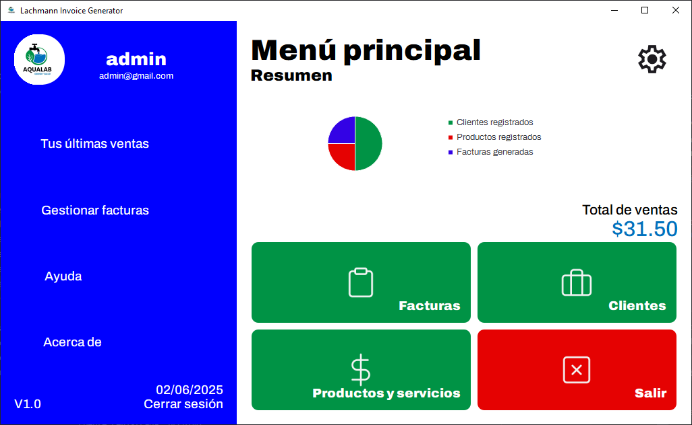
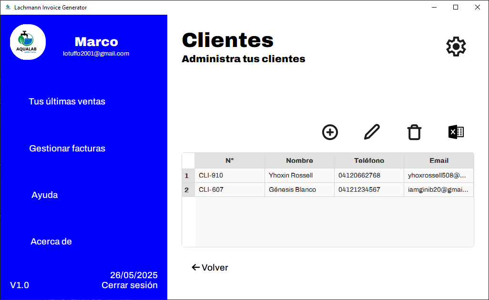
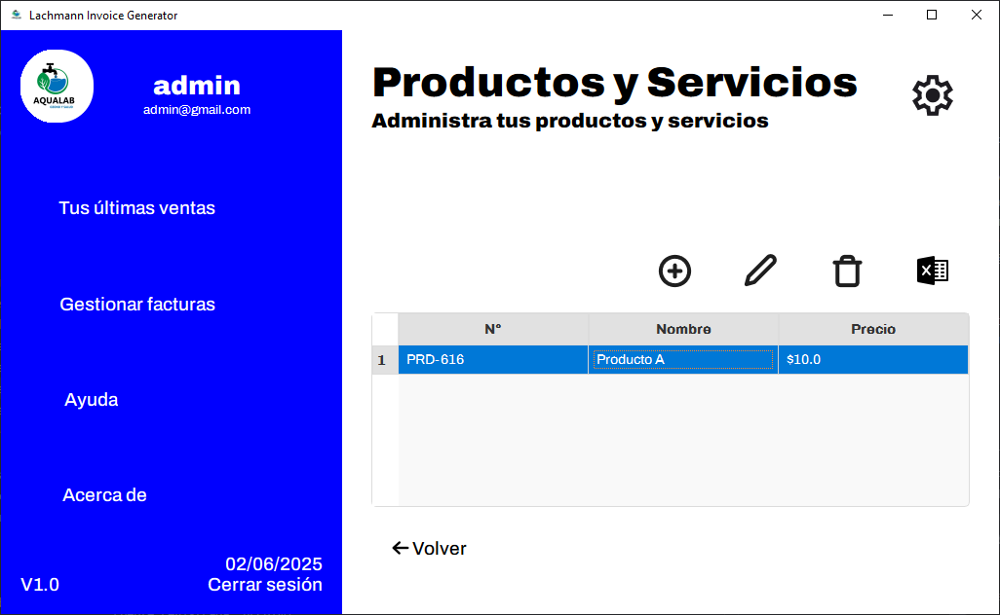
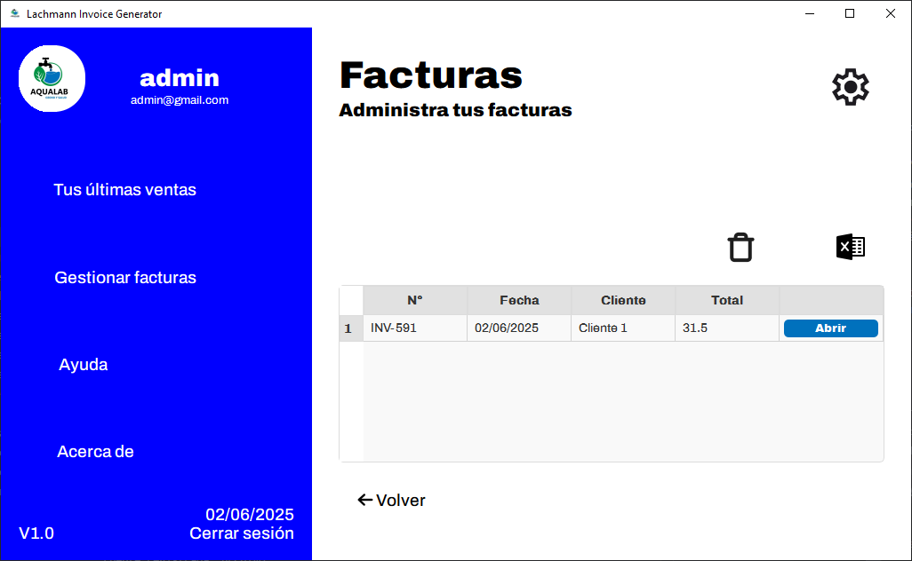

## LANCHMANN INVOICE GENERATOR
Open-Source invoice generation and inventory system for small and medium enterprises.

---

### Main Features

- Client management: add, edit, delete, and view your clients' information.
- Product and service management: manage your catalog of products and services.
- Electronic invoicing: generate, view, and export invoices in PDF format.
- Excel export: export client, product, and invoice data to Excel.
- Modern and user-friendly interface.
- Windows compatible (standalone executable available).

---

### Screenshots

#### Main Menu


#### Clients Module


#### Products and Services Module


#### Invoicing Module


---

## Installation and Usage

### Prepare Environment

Install virtualenv:
```sh
pip install virtualenv
```

Create the virtual environment:
```sh
python -m venv venv
```

Activate the environment (Windows):
```sh
venv\Scripts\activate
```

### Install dependencies

Upgrade pip if needed:
```sh
python -m pip install --upgrade pip
```

Install requirements:
```sh
pip install -r requirements.txt
```

### Run the application

```sh
python .
```

Or just download de .exe file on Releases. :)

## Buy me a coffee:
- Binance Pay: yhoxrossell508@gmail.com (USDT only) 